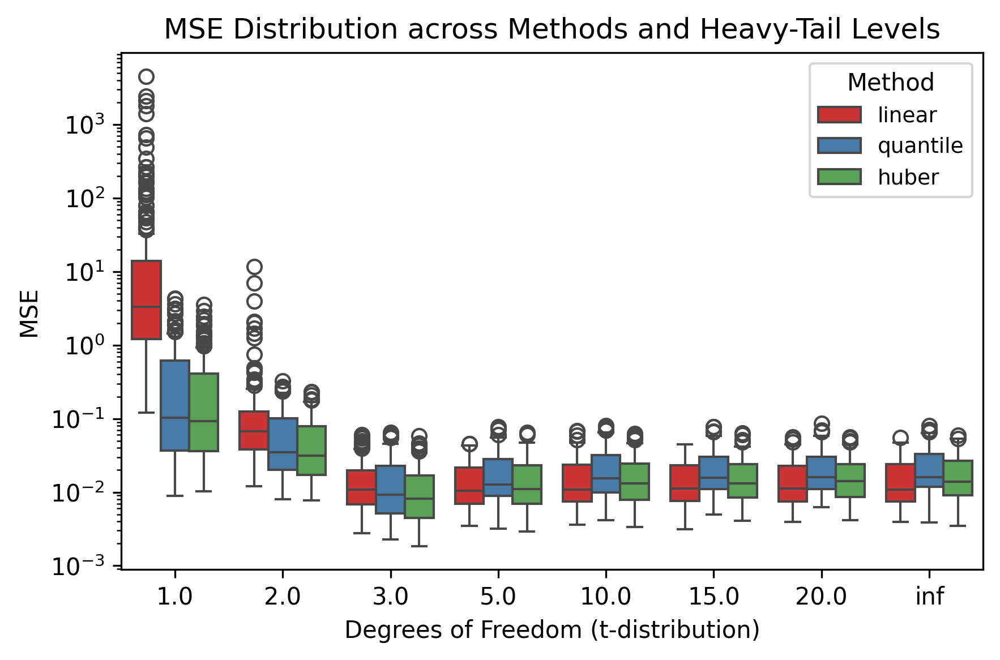
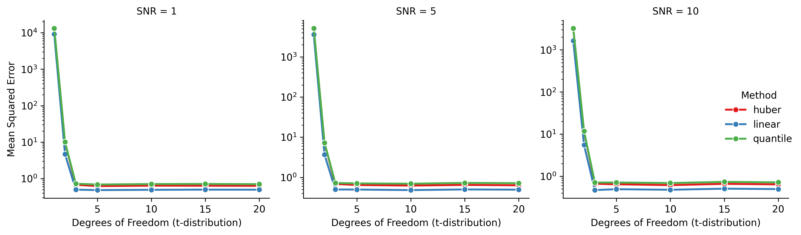

# Robust Regression Simulation Study

A comprehensive simulation framework for comparing robust regression methods under heavy-tailed error distributions.

## Overview

This project evaluates the performance of three regression methods—**Linear Regression**, **Quantile Regression**, and **Huber Regression**—across varying levels of error tail heaviness (controlled by t-distribution degrees of freedom) and signal-to-noise ratios.

## Project Structure

```
.
├── Data_Generation.py      # Functions for generating synthetic data
├── Models.py               # Regression model implementations
├── analysis.py             # Visualization functions
├── run_simulations.py      # Main simulation orchestration
├── simulation_results.csv  # Generated results (after running)
├── mse_vs_df.png          # MSE trends faceted by SNR
└── mse_small_multiples.png # MSE distributions (boxplots)
```

## Pipeline

### 1. Data Generation (`Data_Generation.py`)

Generates synthetic regression data with the following structure:

**Model**: y = Xβ + ε

**Key Components**:
- **Design Matrix (X)**: Multivariate normal with autoregressive correlation structure
  - Covariance: Cov(X_j, X_k) = ρ^|j-k|
  - Default ρ = 0.5
  
- **Coefficients (β)**: Scaled to achieve target signal-to-noise ratio
  - SNR = β'X'Xβ / σ²
  
- **Errors (ε)**: Student t-distribution with varying degrees of freedom
  - Lower df → heavier tails (more outliers)
  - df = ∞ → Normal distribution

**Functions**:
- `generate_design_matrix()`: Creates correlated predictor matrix
- `generate_beta()`: Generates coefficient vector scaled to target SNR
- `generate_errors()`: Samples from t-distribution or normal
- `generate_data()`: Combines all components into (X, y) dataset

### 2. Model Fitting (`Models.py`)

Implements three regression approaches:

| Method | Description | Robustness |
|--------|-------------|------------|
| **Linear** | Ordinary Least Squares (OLS) | Not robust to outliers |
| **Quantile** | Median regression (τ = 0.5) | Robust to outliers |
| **Huber** | M-estimator with adaptive loss | Moderately robust |

**Function**: `MyModel(X, y, method, quantile=0.5)`
- Fits specified model
- Returns dictionary with model type and MSE

### 3. Simulation Execution (`run_simulations.py`)

**Main Function**: `run_simulations()`

**Simulation Grid**:
- **Sample size (n)**: 200
- **Aspect ratio (p/n)**: [0.2, 0.5, 0.8]
- **Degrees of freedom (df)**: [1, 2, 3, 5, 10, 15, 20, ∞]
- **AR correlation (ρ)**: [0.2]
- **Signal-to-Noise Ratio (SNR)**: [1, 5, 10]
- **Replicates**: 30 per configuration

**Process**:
1. Creates parameter grid (all combinations)
2. For each configuration:
   - Generates one dataset
   - Fits all three methods on the same data
   - Computes MSE for each method
3. Parallelizes across configurations using `joblib`
4. Saves results to CSV

### 4. Analysis & Visualization (`analysis.py`)

**Generated Figures**:

#### Figure 1: MSE vs Degrees of Freedom (Faceted by SNR)
`mse_vs_df.png`

- **Type**: Line plots with facets
- **X-axis**: Degrees of freedom (tail heaviness)
- **Y-axis**: Mean Squared Error (log scale)
- **Facets**: One panel per SNR level
- **Lines**: One per method (colored)

**Interpretation**:
- Lower df = heavier tails = more challenging
- Shows which method is most robust at each SNR level
- Log scale reveals relative performance differences

#### Figure 2: MSE Distribution Across Methods
`mse_small_multiples.png`

- **Type**: Boxplots
- **X-axis**: Degrees of freedom
- **Y-axis**: MSE (log scale)
- **Groups**: Methods (color-coded)

**Interpretation**:
- Shows variability in MSE across replicates
- Reveals consistency of method performance
- Identifies outlier runs

## Installation

Clone using the web URL:

```bash
git clone https://github.com/Celestine97/STATS607-Week7.git
cd STATS607-Week7
```

Create a virtual environment (recommended):

```bash
python -m venv venv
```

Activate the virtual environment:
```bash
# On Windows (Command Prompt)
venv\Scripts\activate

# On Windows (Git Bash or PowerShell)
source venv/Scripts/activate

# On macOS/Linux
source venv/bin/activate
```

Required packages:
```bash
pip install -r requirements.txt
```

## Usage

### Run Complete Simulation

```python
python run_simulations.py
```

This will:
1. Execute 5,760 simulation runs (= 3 ARs × 8 dfs × 1 ρ × 3 SNRs × 30 reps × 3 methods)
2. Save results to `simulation_results.csv`
3. Generate both visualization figures

### Custom Simulation

```python
from run_simulations import run_simulations, analyze_results

# Customize parameters
df_results = run_simulations(
    n=100,
    aspect_ratio=[0.5],
    dfs=[1, 3, 5, 10],
    snrs=[1, 5],
    reps=50,
    n_jobs=4,
    seed=42
)

# Generate plots
analyze_results(df_results)
```

### Generate Data Only

```python
from Data_Generation import *

rng = np.random.default_rng(42)
n, p = 100, 50
snr, df = 5, 3

X_temp = generate_design_matrix(n, p, rho=0.5, rng=rng)
beta = generate_beta(p, snr=snr, X=X_temp, rng=rng)
X, y = generate_data(n, p, beta=beta, df=df, rho=0.5, rng=rng)
```

## Key Parameters

| Parameter | Symbol | Description | Default |
|-----------|--------|-------------|---------|
| `n` | n | Sample size | 200 |
| `aspect_ratio` | γ | Ratio p/n (dimensionality) | [0.2, 0.5, 0.8] |
| `df` | ν | t-distribution degrees of freedom | [1, 2, 3, 5, 10, 15, 20, ∞] |
| `rho` | ρ | AR correlation parameter | 0.2 |
| `snr` | SNR | Signal-to-noise ratio | [1, 5, 10] |
| `reps` | - | Monte Carlo replicates | 30 |

## Results




- **Heavy tails (df ≤ 3)**: Quantile and Huber outperform Linear
- **Light tails (df ≥ 20)**: All methods perform similarly
- **High SNR**: Differences between methods diminish
- **Low SNR**: Robust methods show clearer advantages

## Reproducibility

All random number generation uses numpy's `Generator` with explicit seeds:
- Master seed set in `run_simulations(seed=0)`
- Each replicate gets independent RNG state
- Full reproducibility guaranteed
